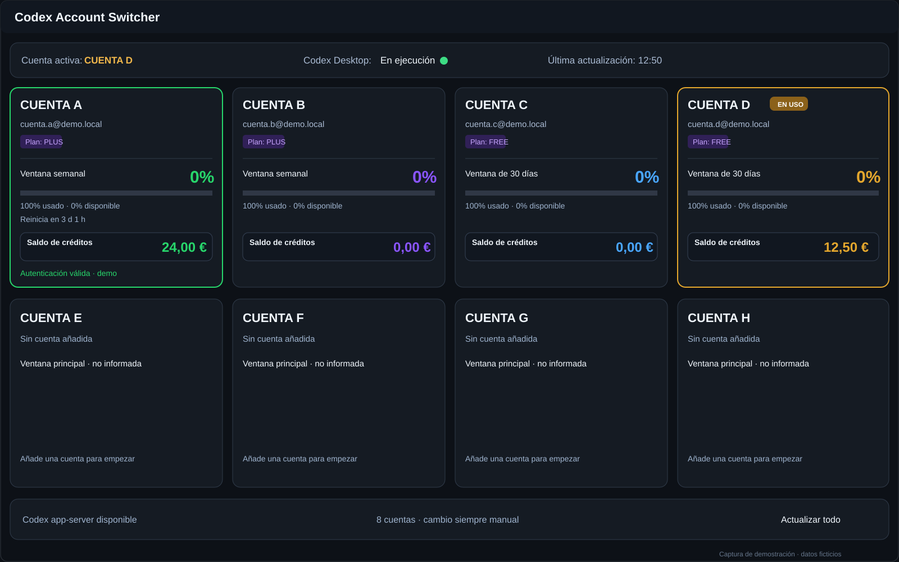
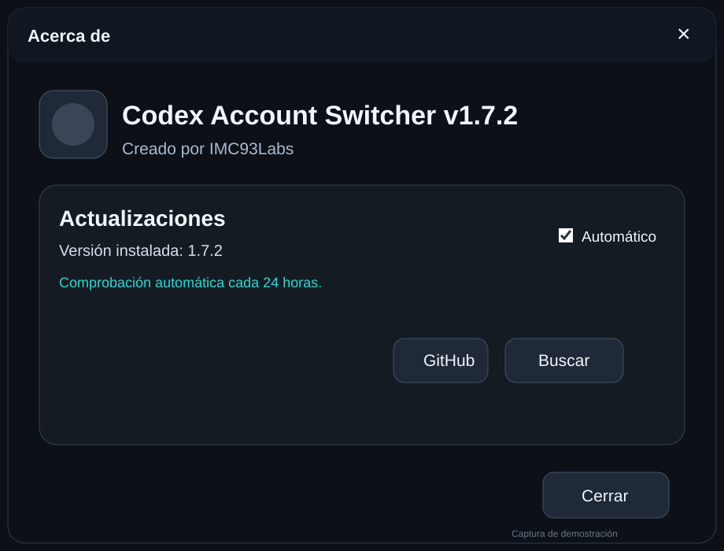
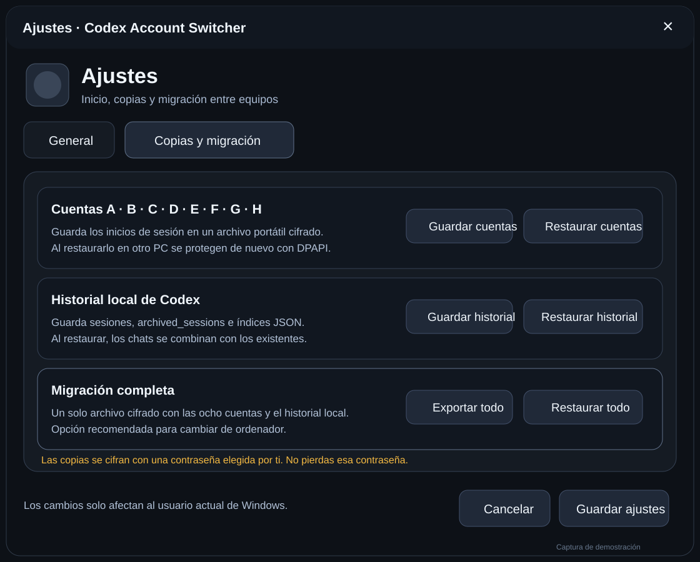

# Codex Account Switcher

**Gestiona y cambia entre varias cuentas de Codex Desktop desde una sola aplicación para Windows.**

`Windows 10/11` · `.NET 8` · `x64` · `OneFile` · `Self-contained`

[**Descargar última versión**](../../releases/latest) · [Soporte](SUPPORT.md) · [Seguridad](SECURITY.md) · [Cambios](CHANGELOG.md)

> [!IMPORTANT]
> **Descarga recomendada:** abre la última **Release** y descarga `CodexAccountSwitcher.exe`. No necesita instalación.

> [!NOTE]
> Proyecto independiente de **IMC93Labs**. No está afiliado, respaldado ni patrocinado por OpenAI.

---

## Qué hace

Codex Account Switcher centraliza en una interfaz compacta el uso legítimo de varias cuentas propias o autorizadas de **Codex Desktop**.

- Hasta **8 cuentas** guardadas localmente.
- Cambio manual rápido entre cuentas, sin balanceo ni rotación automática de límites.
- Lectura de límites de uso y ventanas de reinicio cuando Codex los informa.
- Visualización de saldo/créditos cuando están disponibles.
- Apertura y control de Codex Desktop desde la utilidad.
- Actualización periódica de la información de las cuentas.
- Bandeja del sistema y arranque con Windows.
- Copias cifradas de cuentas, historial local y migración completa entre equipos.
- Actualizador integrado desde las Releases oficiales de este repositorio.

## Capturas de demostración

Las imágenes siguientes reproducen la interfaz de la aplicación con **cuentas y datos completamente ficticios**. No contienen correos, tokens ni información privada del desarrollador.

### Ventana principal

<table>
<tr>
<td width="50%" valign="top"><b>Acerca de</b>  </td>
<td width="50%" valign="top"><b>Ajustes y migración</b>  </td>
</tr>
</table>

## Descarga e integridad

Las versiones oficiales se publican únicamente en **[GitHub Releases](../../releases)**.

1. Descarga `CodexAccountSwitcher.exe` de la última Release.
2. Si quieres verificar el archivo, compara su SHA-256 con `SHA256SUMS.txt`.
3. `RELEASE_MANIFEST.json` documenta versión, arquitectura, build, pruebas y advertencias de cada publicación.
4. `update.json` es utilizado por el actualizador integrado de la aplicación.

El ejecutable publicado es **Windows x64, self-contained y OneFile**, por lo que no requiere instalar .NET por separado.

### Sobre “Source code (zip)” y “Source code (tar.gz)”

GitHub genera automáticamente esos dos enlaces para cada tag. En este repositorio contienen **solo la documentación y metadatos públicos del repositorio de Releases**; **no contienen el código fuente de Codex Account Switcher**.

## Privacidad y seguridad

- El código fuente de la aplicación **no se publica en este repositorio**.
- Las credenciales y sesiones no deben publicarse en Issues, capturas ni registros.
- Las copias portátiles creadas por la aplicación se protegen con la contraseña elegida por el usuario.
- Los datos locales sensibles se vuelven a proteger con DPAPI al restaurarlos en el usuario de Windows de destino.
- Consulta [SECURITY.md](SECURITY.md) antes de informar públicamente de un problema sensible.

## Uso responsable

La herramienta no crea cuentas, no combina suscripciones, no suma cuotas entre cuentas y no está diseñada para eludir límites, facturación, autenticación ni controles de acceso. Cada usuario es responsable de utilizar únicamente cuentas que le pertenezcan o que esté autorizado a usar y de cumplir las condiciones aplicables al servicio.

## Soporte

- **Errores:** Issues → `Report a bug / Reportar un problema`.
- **Mejoras:** Issues → `Request an improvement / Solicitar una mejora`.
- **Ayuda general:** Discussions.
- **Seguridad:** [SECURITY.md](SECURITY.md).
- **Guía completa:** [SUPPORT.md](SUPPORT.md).

## Aviso

Codex Account Switcher es un proyecto personal de IMC93Labs desarrollado con asistencia de herramientas de IA. Se publica **tal cual y sin garantías**; conserva copias de seguridad de cualquier dato importante. Consulta [DISCLAIMER.md](DISCLAIMER.md) para el aviso completo.

---

<b>English</b>

### Codex Account Switcher

A Windows utility for people who legitimately use multiple owned or authorized Codex Desktop accounts and want a cleaner local switching workflow.

**Main features:** up to 8 saved accounts, manual account switching, usage-limit and credit display when reported by Codex, system tray/startup options, encrypted account/history backups, full PC-to-PC migration, and an integrated updater using this repository's official Releases.

**Recommended download:** open the [latest Release](../../releases/latest) and download `CodexAccountSwitcher.exe`. The app is Windows x64, self-contained and OneFile.

The application source code is **not published in this repository**. GitHub's automatically generated `Source code (zip)` and `Source code (tar.gz)` downloads contain only this public release/documentation repository, not the application's private source code.

This is an independent IMC93Labs project and is **not affiliated with, endorsed by, or sponsored by OpenAI**. It does not create accounts, combine subscriptions or quotas, or bypass service limits, billing, authentication or access controls.

For support see [SUPPORT.md](SUPPORT.md), for security-sensitive reports see [SECURITY.md](SECURITY.md), and for the full notice see [DISCLAIMER.md](DISCLAIMER.md).

---

<b>Codex Account Switcher · IMC93Labs</b>

